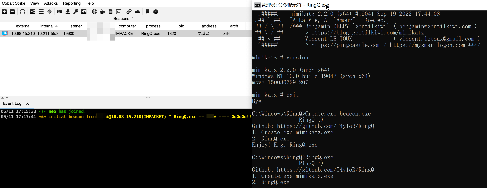
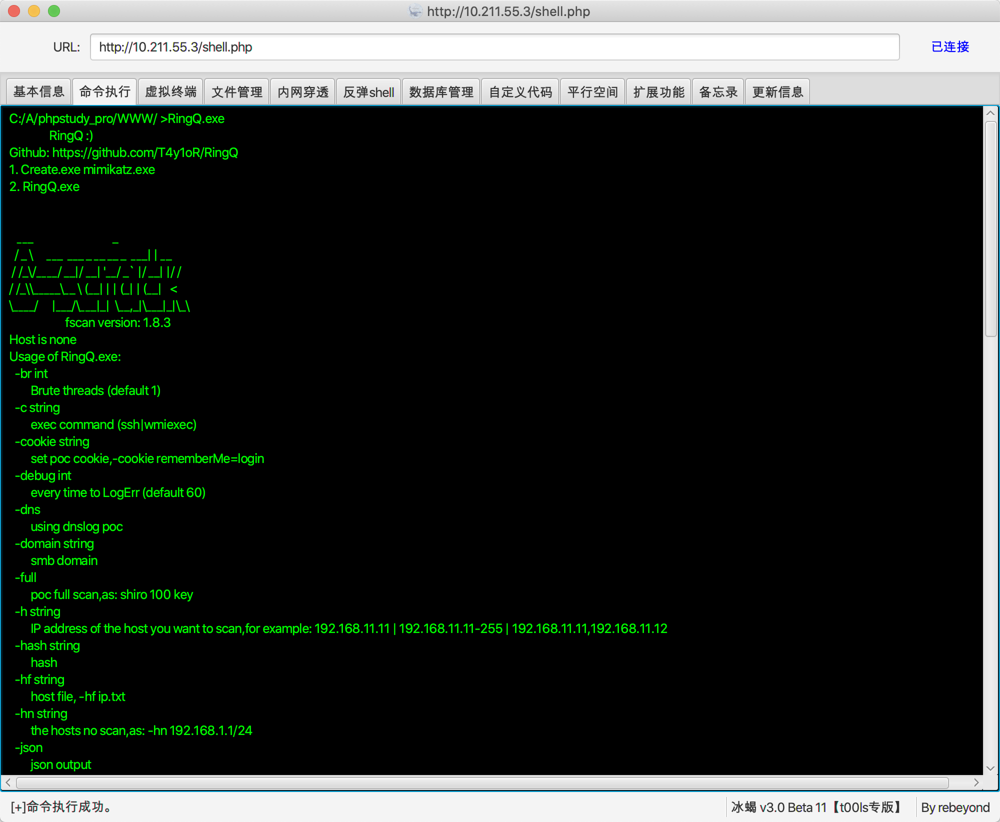
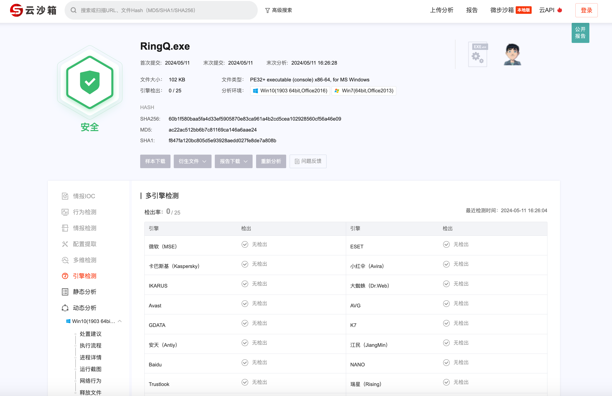
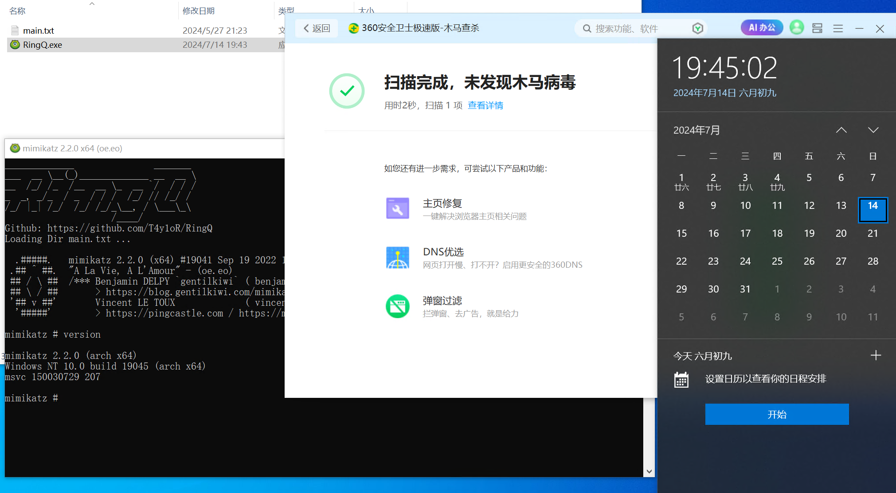
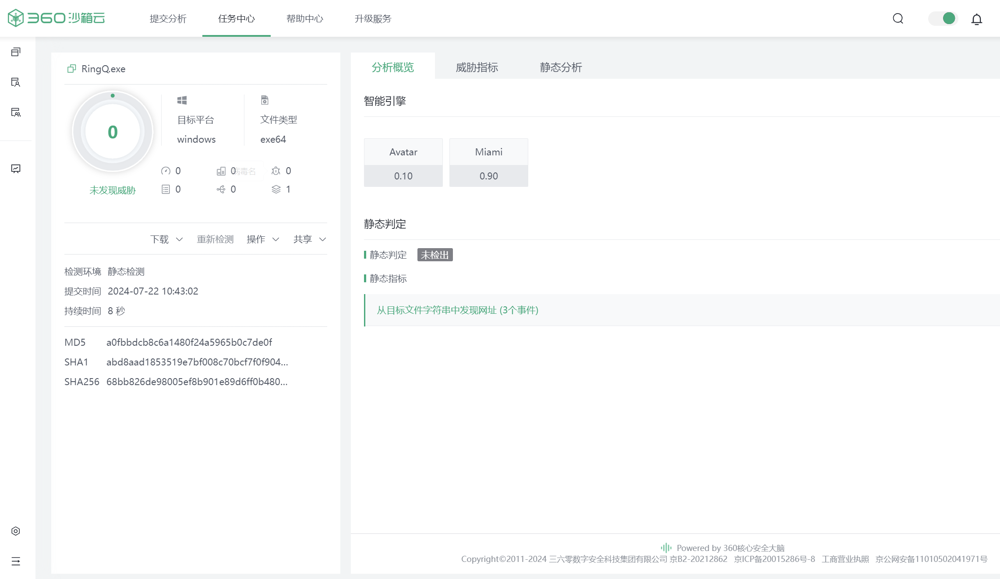
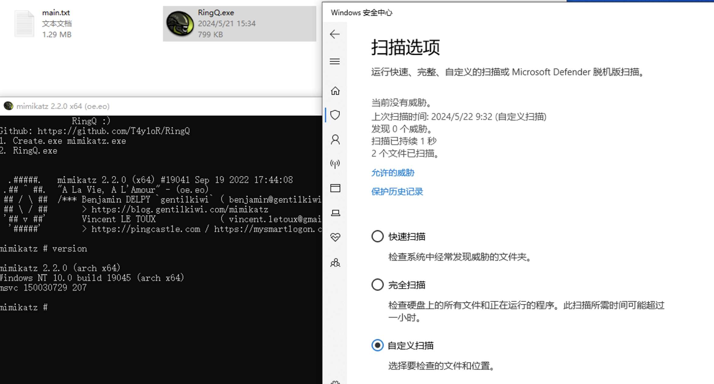
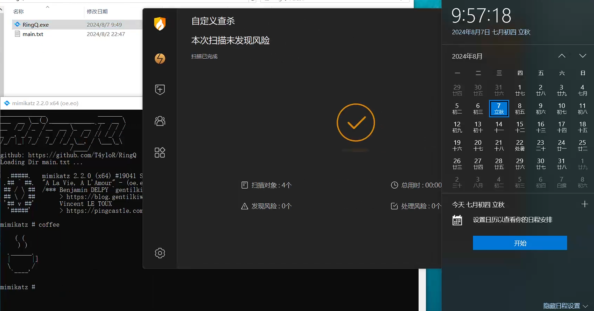
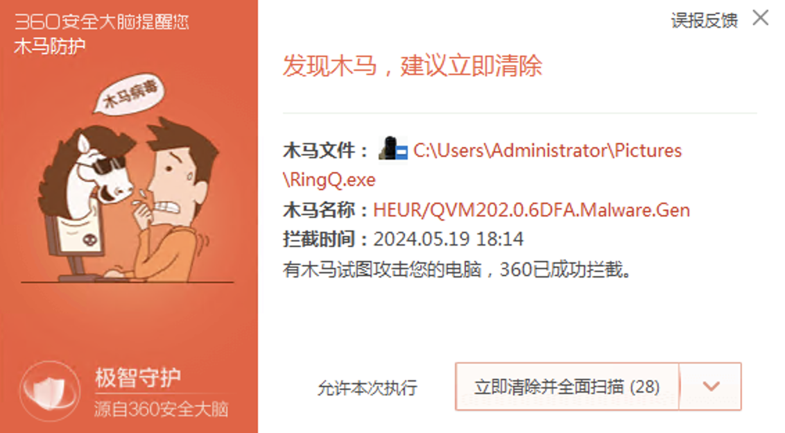
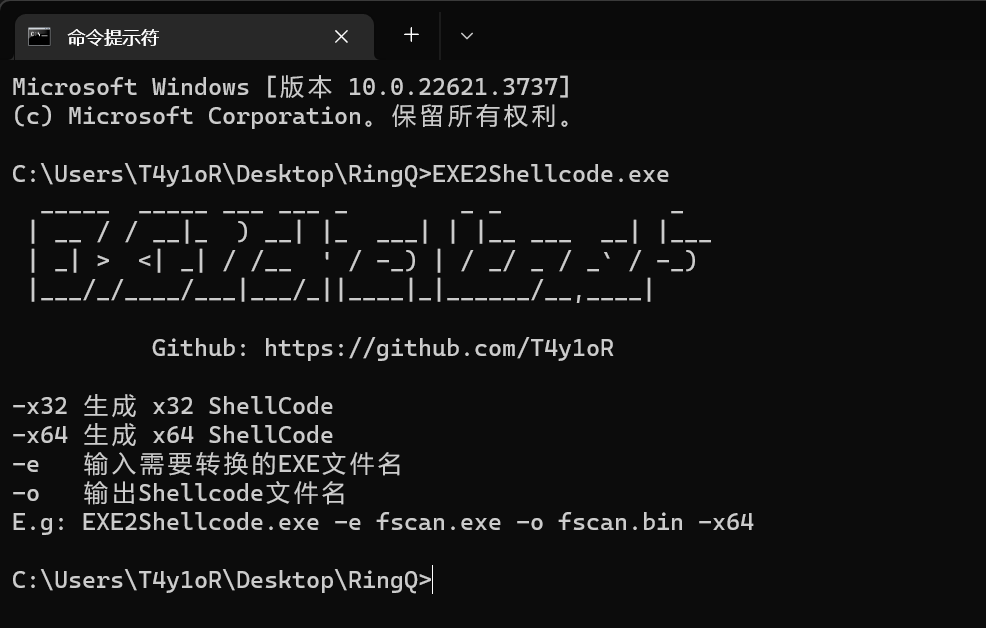

# RingQ

### 背景：

后渗透场景，杀毒软件落地秒了我的大保健 fscan mimikatz ...  这还让我怎么内网渗透啊？


### 目的：

不用关心怎么实现免杀，也不用浪费时间和精力去对某一款工具进行专项修改达成免杀效果

助力每一位像我这样的脚本小子快速实现免杀，hvv尽快打穿目标内网

支持bypass 360 火绒 Windows Defender，一键免杀上线CS、fscan、mimikatz ...

RingQ 免杀框架，简单修改源码 加载方式、加密混淆、执行逻辑等 即可快速免杀 

 


### 使用方法：

1. 将需要免杀的exe工具，放在与Create.exe 同文件夹下运行即可，会生成一个混淆的main.txt文件。
   
   <u>*Create.exe 此程序仅用于混淆生成main.txt文件，可能存在报毒(c++你懂的) 添加白名单or虚拟机断网使用都可以。*</u>

   ```
   Create.exe fscan.exe      
   ```
   ```
   Create.exe CobaltStrike.bin  
   ```


2. 将main.txt和RingQ.exe上传到目标机器，执行 RingQ.exe ~

   内置反沙箱等 执行后有些许延迟 耐心一会儿 :)

   ```
   RingQ.exe
   ```

#### 本地加载
   

#### 远程加载
   

#### 绝对路径加载
   

#### CS shellcode
   

#### 举个栗子
   
   

### **微步**


### **360**（2024.07.30更新）



### **Windows Defender**（2024.07.30更新）


### **火绒6.0**（2024.07.30更新）



### QVM202 报毒是启发式静态扫描，修改文件资源伪造成正常文件一样即可绕过。

### 添加签名、文件名、图标、属性信息、资源...

<div align="center"></div>


### [QVM250](https://github.com/T4y1oR/RingQ/tree/main/QVM250)（bypass 360 QVM202）


<u>*图标支持自定义，存放在QVM250/main文件夹内即可。*</u>


### [EXE2Shellcode.exe](https://github.com/T4y1oR/RingQ/blob/main/EXE2Shellcode.exe)（将你的exe工具转换成Shellcode）

该程序可以将你需要免杀的exe工具转换成Shellcode，和`Create.exe fscan.exe`作用相同。

区别在于Create.exe内置XOR混淆，可以直接配合RingQ.exe程序直接使用。

EXE2Shellcode.exe生成后的Shellcode需要自行混淆+修改RingQ源码加载使用  ~~或者配合你自己的Shellcode加载器使用~~

<div align="center"></div>


## [已开源](https://github.com/T4y1oR/RingQ/tree/main/RingQ)，放心食用，编译后的RingQ.exe是经过bypass QVM202的  ~~帮助懒惰的脚本小子~~   如不放心可自行编译使用[QVM250](https://github.com/T4y1oR/RingQ/tree/main/QVM250)即可。

## 后续如报毒属于正正正正正常现象，提issues（报毒截图and时间环境信息）耐心等待更新即可。tips:  Star后更新更快！

## 项目仅供进行学习研究，切勿用于任何非法未授权的活动，如个人使用违反安全相关法律，后果与本人无关。


### 更新日志

2024.07.30  Create.exe生成后的main.txt特征去除，360 火绒 DF 报毒 均已更新

2024.07.22  360QVM202报毒 已更新

2024.07.17  360QVM202报毒 已更新，火绒标记Hacktools 已更新 

2024.07.14  360标记Trojan 木马 已更新

2024.07.11  360标记Trojan 木马 已更新，火绒标记Hacktools 已更新 

2024.07.09  360标记Trojan 木马 已更新

2024.07.08  360QVM202报毒 已更新，火绒标记Hacktools 已更新

2024.07.07  修复EXE2Shellcode BUG

2024.07.04  360QVM202报毒 已更新，修改小部分代码特征 

2024.07.01  360QVM202报毒 已更新，火绒标记Hacktools 已更新

2024.06.27  新增EXE转换成Shellcode工具，支持x32和x64    [EXE2Shellcode.exe](https://github.com/T4y1oR/RingQ/blob/main/EXE2Shellcode.exe)

2024.06.26  360QVM202报毒 已更新。

2024.06.24  360QVM202报毒 已更新，火绒标记Hacktools 已更新

2024.06.21  360QVM202报毒 已更新，修改部分代码逻辑

2024.06.20  360QVM202报毒 已更新，修复执行无响应

2024.06.19  更新Banner，优化部分源码。  

2024.06.18  360QVM202报毒 已更新。 ~~最近有点忙啊啊啊~~

2024.06.11  火绒标记Hacktools 已更新（Create.exe无需更新 仅用于生成混淆文件），360QVM202报毒 已更新

2024.06.05  CMD执行卡住BUG 已修复

2024.06.04  测试时遗留的StringTable 已删除

2024.05.31-06.04  360QVM202报毒 已更新，<u>开源RingQ</u>  

2024.05.30  360QVM202报毒 已更新，新增CS shellcode加载上线

2024.05.28  更新两种加载方式，远程加载and绝对路径加载 

2024.05.27  360QVM202报毒 已更新

2024.05.24  RingQ 360QVM202报毒 已更新，Create火绒报毒 已更新，QVM250失效 已更新

2024.05.23  360QVM202报毒 已更新，火绒报毒mimikatz 已更新

2024.05.22  QVM250发布，bypass 360QVM202 持续报毒 生成后的文件多执行几次脚本 (开源项目有效期短) 

2024.05.14-21 360QVM202报毒 已更新，这个报毒自行更换图标，添加签名...  ~~如果持续出现这个问题，多点star出个专项bypass QVM202脚本~~  Releases新增RingQ.exe原编译出的main.exe文件，方便大家自定义修改降熵

2024.05.11  项目发布，微步纯绿 企业360云沙箱 火绒 卡巴斯基  ~~没传VT是为了能大家能用久点，大家随意~~


### TODO

- [x] unhook ~~暂不开源~~
- [x] syscalls  ~~暂不开源~~
- [x] 反沙箱 
- [x] [致盲火绒 - LoveSysdiag](https://github.com/T4y1oR/LoveSysdiag) 
- [x] 远程加载
- [x] bypass QVM202
- [ ] ...


[](https://starchart.cc/T4y1oR/RingQ)

